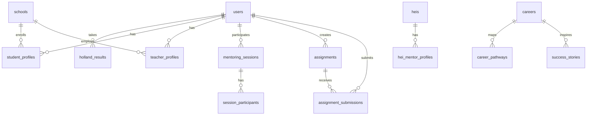

<p align="center">
  
</p>

<h1 align="center">🎓 Uttarakhand Government School Mentoring Platform</h1>

<p align="center">
  <strong>Bridging the gap between rural government schools and Higher Education Institutions through virtual mentoring, career guidance, and NCERT-aligned learning.</strong>
</p>

<p align="center">
  
  
  
  
  
  
  
</p>

---

## 📋 Table of Contents

- [About the Project](#-about-the-project)
- [Key Features](#-key-features)
- [Architecture Overview](#-architecture-overview)
- [Tech Stack](#-tech-stack)
- [User Roles & Dashboards](#-user-roles--dashboards)
- [Database Schema](#-database-schema)
- [API Documentation](#-api-documentation)
- [Getting Started](#-getting-started)
- [Environment Variables](#-environment-variables)
- [Deployment](#-deployment)
- [Project Structure](#-project-structure)
- [Security](#-security)
- [Contributing](#-contributing)

---

## 🌄 About the Project

**UK-GSMP** (Uttarakhand Government School Mentoring Platform) is a full-stack web application designed to **transform rural education in Uttarakhand** by connecting government school students with mentors from Higher Education Institutions (HEIs).

The platform addresses the critical challenge of **educational inequity** in remote Uttarakhand regions by providing:

- 🎯 **Holland Code (RIASEC) Career Assessment** — AI-powered personality-career matching tailored to rural-relevant scenarios
- 📹 **Virtual Mentoring Sessions** — with auto-generated Google Meet links for seamless HEI mentor-student connections
- 📝 **NCERT-Aligned Assignment System** — teachers create, students submit, mentors review — with secure file uploads
- 🔐 **Role-Based Access Control** — five distinct user roles with dedicated dashboards

> *"Empowering rural students through technology and mentorship."*

---

## ✨ Key Features

### 🧠 Holland Career Assessment (RIASEC)
- 18 research-backed questions across 6 personality dimensions
- Questions contextualized for **rural Indian students** (farming, community service, local trades)
- Server-side scoring with top-3 dimension extraction
- Career matching from a curated database of 30+ career paths
- Results persisted in database for longitudinal tracking

### 📹 Virtual Mentoring
- **Google Calendar API integration** with automatic Google Meet link generation
- Session scheduling with mentor-student linking
- Graceful degradation when Google credentials are unavailable
- Multi-layered error handling (auth errors, rate limits, network failures)
- Mentor availability tracking and session history

### 📚 Assignment Management
- Teachers and mentors create NCERT-referenced assignments with marking criteria
- Students submit homework via **secure file uploads** (PDF, images)
- MIME-type validation + extension cross-checking to prevent spoofing
- Per-student directory isolation for submissions
- Filename sanitization against directory traversal attacks

### 🔐 Authentication & Security
- **Supabase Auth** with dual-algorithm JWT verification (HS256 + RS256)
- HttpOnly cookie-based session management
- Role-based route guards (`STUDENT`, `TEACHER`, `HEI_MENTOR`, `SCHOOL_ADMIN`, `HEI_ADMIN`)
- Service-role admin operations for user registration
- CORS configuration for production (Vercel) and development

### 📱 Responsive Design
- **Mobile-first** responsive layouts with adaptive sidebars
- Bottom navigation bar for mobile devices
- Collapsible sidebar with overlay on tablet/mobile
- Glassmorphism header with backdrop blur effects

---

## 🏗 Architecture Overview

```
┌────────────────────────────────────────────────────────────────┐
│                        CLIENT (Next.js 15)                     │
│  ┌──────────┐  ┌──────────┐  ┌──────────┐  ┌──────────┐      │
│  │ Student  │  │ Teacher  │  │   HEI    │  │  Admin   │      │
│  │Dashboard │  │Dashboard │  │  Mentor  │  │Dashboard │      │
│  └────┬─────┘  └────┬─────┘  └────┬─────┘  └────┬─────┘      │
│       │              │              │              │            │
│  ┌────┴──────────────┴──────────────┴──────────────┴────┐      │
│  │              AuthProvider (useAuth hook)              │      │
│  │           HttpOnly Cookie Authentication             │      │
│  └──────────────────────┬───────────────────────────────┘      │
└─────────────────────────┼──────────────────────────────────────┘
                          │ REST API (fetch + credentials)
                          ▼
┌────────────────────────────────────────────────────────────────┐
│                     SERVER (NestJS 11)                          │
│  ┌──────────┐  ┌──────────┐  ┌───────────┐  ┌──────────┐     │
│  │   Auth   │  │Assessment│  │ Mentoring │  │Assignments│     │
│  │  Module  │  │  Module  │  │  Module   │  │  Module   │     │
│  └────┬─────┘  └────┬─────┘  └─────┬─────┘  └────┬─────┘     │
│       │              │              │              │            │
│  ┌────┴──────────────┴──────────────┴──────────────┴────┐      │
│  │              Supabase Service (shared client)         │      │
│  └──────────────────────┬───────────────────────────────┘      │
│                         │                                      │
│  ┌──────────────────────┴───────────────────────────────┐      │
│  │         Google Calendar API (Meet links)              │      │
│  └───────────────────────────────────────────────────────┘      │
└─────────────────────────┼──────────────────────────────────────┘
                          │
                          ▼
┌────────────────────────────────────────────────────────────────┐
│                   SUPABASE (PostgreSQL)                         │
│  ┌──────────┐  ┌──────────┐  ┌───────────┐  ┌──────────┐     │
│  │  users   │  │ holland_ │  │ mentoring │  │assignment│     │
│  │ext_users │  │assessments│ │ _sessions │  │submissions│    │
│  └──────────┘  └──────────┘  └───────────┘  └──────────┘     │
└────────────────────────────────────────────────────────────────┘
```

---

## 🛠 Tech Stack

| Layer | Technology | Purpose |
|-------|-----------|---------|
| **Frontend** | Next.js 15 (Turbopack) | React framework with App Router |
| **UI Components** | Radix UI + shadcn/ui | Accessible, headless UI primitives |
| **Styling** | Tailwind CSS 4 | Utility-first CSS framework |
| **Backend** | NestJS 11 | Enterprise Node.js framework |
| **Database** | Supabase (PostgreSQL) | BaaS with Auth, RLS, and Realtime |
| **Authentication** | Supabase Auth + JWT | Dual-algorithm cookie-based auth |
| **Video Conferencing** | Google Calendar API | Auto-generated Google Meet links |
| **File Uploads** | Multer | Secure multi-part file handling |
| **API Documentation** | Swagger (OpenAPI) | Auto-generated API docs |
| **Validation** | class-validator + class-transformer | DTO validation with decorators |
| **Deployment** | Vercel (client) + Render (server) | Cloud hosting |

---

## 👥 User Roles & Dashboards

### 🎒 Student
| Feature | Description |
|---------|-------------|
| Career Assessment | Take the Holland (RIASEC) personality test with 18 questions |
| Career Results | View matched careers, personality dimensions, and score breakdown |
| Mentoring Sessions | See upcoming sessions scheduled by your mentor |
| Assignments | Browse and submit homework with file uploads |
| Mentor Selection | Choose from available HEI mentors |

### 📖 Teacher
| Feature | Description |
|---------|-------------|
| Create Assignments | NCERT-referenced tasks with marking criteria and due dates |
| View Submissions | Table view of student homework submissions |
| Student Management | Track student progress and class performance |

### 🎓 HEI Mentor
| Feature | Description |
|---------|-------------|
| Schedule Sessions | Book mentoring sessions with auto-generated Google Meet links |
| Manage Mentees | View and manage all linked students |
| Create Assignments | Cross-institutional assignment creation |
| Session History | Track past and upcoming mentoring sessions |

### 🏫 School Admin & 🏛 HEI Admin
| Feature | Description |
|---------|-------------|
| Institution Management | Manage school/HEI details |
| User Management | Oversee teachers, mentors, and students |

---

## 🗄 Database Schema

The platform uses **35+ tables** in Supabase (PostgreSQL). Key entities:



**Core Tables:**

| Table | Purpose |
|-------|---------|
| `users` / `ext_users` | User accounts with role-based profiles |
| `holland_assessments` | RIASEC personality test results (R,I,A,S,E,C scores) |
| `mentoring_sessions` | Scheduled sessions with Google Meet links |
| `mentor_student_links` | Mentor-student pairing relationships |
| `assignments` | NCERT-aligned homework tasks |
| `submissions` | Student homework file uploads |
| `schools` | Government school registry |
| `heis` | Higher Education Institution registry |
| `careers` | Career database with Holland codes |
| `career_pathways` | Step-by-step career progression paths |
| `ncert_chapters` | NCERT curriculum reference data |

---

## 📡 API Documentation

The server exposes a RESTful API at `/api` with **Swagger docs** available in development at `/api/docs`.

### Auth Endpoints

| Method | Endpoint | Description | Auth |
|--------|----------|-------------|------|
| `POST` | `/api/auth/register` | Register new user (with role) | Public |
| `POST` | `/api/auth/login` | Login → sets httpOnly cookie | Public |
| `POST` | `/api/auth/logout` | Clear auth cookie | Public |
| `GET` | `/api/auth/profile` | Get current user from JWT | 🔒 |
| `GET` | `/api/auth/health` | Auth module health check | Public |

### Assessment Endpoints

| Method | Endpoint | Description | Auth |
|--------|----------|-------------|------|
| `POST` | `/api/assessment/submit` | Submit RIASEC assessment | 🔒 Student |
| `GET` | `/api/assessment/results` | Get latest assessment result | 🔒 Student |

### Mentoring Endpoints

| Method | Endpoint | Description | Auth |
|--------|----------|-------------|------|
| `POST` | `/api/mentoring/schedule` | Schedule session + generate Meet link | 🔒 Mentor |
| `GET` | `/api/mentoring/sessions` | Get sessions for current user | 🔒 |
| `GET` | `/api/mentoring/mentors` | List available HEI mentors | 🔒 |
| `POST` | `/api/mentoring/choose-mentor` | Student selects a mentor | 🔒 Student |
| `GET` | `/api/mentoring/my-mentor` | Get student's current mentor | 🔒 Student |
| `GET` | `/api/mentoring/my-mentees` | Get mentor's students | 🔒 Mentor |
| `GET` | `/api/mentoring/calendar-health` | Google Calendar integration status | 🔒 |

### Assignment Endpoints

| Method | Endpoint | Description | Auth |
|--------|----------|-------------|------|
| `POST` | `/api/assignments` | Create new assignment | 🔒 Teacher/Mentor |
| `GET` | `/api/assignments` | List all assignments | 🔒 |
| `GET` | `/api/assignments/mine` | List creator's assignments | 🔒 |
| `POST` | `/api/assignments/:id/submit` | Submit homework (file upload) | 🔒 Student |
| `GET` | `/api/assignments/:id/submissions` | View submissions | 🔒 |
| `GET` | `/api/assignments/my-submissions` | Student's submission history | 🔒 |

---

## 🚀 Getting Started

### Prerequisites

- **Node.js** ≥ 18
- **pnpm** or **npm**
- **Supabase** project (free tier works)
- **Google Cloud** service account (optional — for Google Meet links)

### 1. Clone the Repository

```bash
git clone https://github.com/Harshit-pandey-bit/uttarakhand-study-management.git
cd uttarakhand-study-management
```

### 2. Setup the Server

```bash
cd server
npm install          # or pnpm install
cp .env.example .env # Edit with your Supabase credentials
npm run start:dev    # Starts on http://localhost:10000
```

### 3. Setup the Client

```bash
cd client
npm install          # or pnpm install
cp .env.example .env # Set NEXT_PUBLIC_API_URL
npm run dev          # Starts on http://localhost:3000
```

### 4. Access Swagger Docs

Open `http://localhost:10000/api/docs` in your browser to explore all API endpoints interactively.

---

## 🔑 Environment Variables

### Server (`server/.env`)

| Variable | Description | Required |
|----------|-------------|----------|
| `SUPABASE_URL` | Supabase project URL | ✅ |
| `SUPABASE_ANON_KEY` | Supabase anonymous key | ✅ |
| `SUPABASE_SERVICE_ROLE_KEY` | Supabase service role key | ✅ |
| `SUPABASE_JWT_SECRET` | JWT secret for token verification | ✅ |
| `JWT_SECRET` | Application JWT secret | ✅ |
| `NODE_ENV` | `development` or `production` | ✅ |
| `PORT` | Server port (default: `10000`) | ❌ |
| `GOOGLE_CREDENTIALS_JSON` | Google service account JSON | ❌ |
| `GOOGLE_CLIENT_EMAIL` | Alt: Google SA client email | ❌ |
| `GOOGLE_PRIVATE_KEY` | Alt: Google SA private key | ❌ |
| `OPENAI_API_KEY` | OpenAI API key (for AI features) | ❌ |
| `FRONTEND_URL` | Client URL for CORS | ❌ |

### Client (`client/.env`)

| Variable | Description | Required |
|----------|-------------|----------|
| `NEXT_PUBLIC_API_URL` | Backend API base URL | ✅ |

---

## 🌐 Deployment

### Client → Vercel

The Next.js frontend is configured for deployment on **Vercel**:

```bash
# Automatic via Vercel GitHub integration
# Or manual:
npx vercel --prod
```

Production URL: `https://uttarakhand-gsmp.vercel.app`

### Server → Render

The NestJS backend includes a `render.yml` for one-click deployment on **Render**:

```yaml
# render.yml is pre-configured with:
- Build: npm install && npm run build
- Start: npm run start:prod
- Health check: /api
- Region: Oregon
```

---

## 📂 Project Structure

```
Uttarakhand-GSMP/
├── client/                          # Next.js 15 Frontend
│   ├── src/
│   │   ├── app/
│   │   │   ├── page.tsx             # Landing page
│   │   │   ├── auth/
│   │   │   │   ├── login/           # Login page
│   │   │   │   └── register/        # Registration page
│   │   │   └── dashboard/
│   │   │       ├── layout.tsx        # Auth-guarded dashboard layout
│   │   │       ├── student/          # Student dashboard & features
│   │   │       │   ├── page.tsx      # RIASEC assessment + mentoring
│   │   │       │   ├── assessment/   # Career assessment page
│   │   │       │   ├── assignments/  # View & submit assignments
│   │   │       │   └── mentoring/    # Mentoring sessions
│   │   │       ├── teacher/          # Teacher dashboard
│   │   │       │   ├── page.tsx      # Create assignments + submissions
│   │   │       │   ├── assignments/  # Assignment management
│   │   │       │   └── students/     # Student tracking
│   │   │       └── hei-mentor/       # HEI Mentor dashboard
│   │   │           ├── page.tsx      # Schedule sessions
│   │   │           ├── schedule/     # Session scheduling
│   │   │           ├── assignments/  # Cross-institutional assignments
│   │   │           └── mentees/      # Mentee management
│   │   ├── components/
│   │   │   ├── ui/                   # shadcn/ui components
│   │   │   ├── layout/              # Sidebar, header
│   │   │   └── mobile-responsive/   # Mobile navigation
│   │   ├── hooks/
│   │   │   └── use-auth.tsx          # Auth context & hooks
│   │   ├── lib/
│   │   │   └── api/client.ts         # API client with credentials
│   │   └── types/
│   │       └── api.ts                # TypeScript interfaces
│   └── package.json
│
├── server/                           # NestJS 11 Backend
│   ├── src/
│   │   ├── main.ts                   # Bootstrap, CORS, Swagger
│   │   ├── app.module.ts             # Root module
│   │   ├── auth/                     # Authentication module
│   │   │   ├── auth.controller.ts    # Login, register, logout, profile
│   │   │   ├── jwt-auth.guard.ts     # Global JWT guard
│   │   │   ├── supabase-jwt.strategy.ts  # Dual-algo JWT strategy
│   │   │   ├── roles.guard.ts        # RBAC guard
│   │   │   └── public.decorator.ts   # @Public() route decorator
│   │   ├── assessment/               # Holland RIASEC module
│   │   │   ├── assessment.service.ts # Score aggregation + career matching
│   │   │   └── riasec-career.map.ts  # Career database for RIASEC codes
│   │   ├── mentoring/                # Mentoring module
│   │   │   └── mentoring.service.ts  # Google Calendar + Meet integration
│   │   ├── assignments/              # Assignments module
│   │   │   ├── assignments.service.ts # CRUD + file submissions
│   │   │   └── upload-security.ts    # Filename sanitization + MIME validation
│   │   └── supabase/                 # Database service
│   │       └── supabase.service.ts   # Shared Supabase client
│   ├── database/
│   │   ├── schema.sql                # Complete database schema (35+ tables)
│   │   ├── migrations/               # Database migrations
│   │   ├── rebuild_schema.sql        # Schema rebuild script
│   │   └── cleanup_database.sql      # Database cleanup utilities
│   ├── render.yml                    # Render deployment config
│   └── package.json
│
└── README.md
```

---

## 🔒 Security

The platform implements multiple layers of security:

| Layer | Implementation |
|-------|---------------|
| **Authentication** | Supabase Auth with httpOnly cookies (no localStorage tokens) |
| **JWT Verification** | Dual-algorithm support (HS256 + RS256) with JWKS fallback |
| **Authorization** | Role-based guards (`@Roles('TEACHER', 'HEI_MENTOR')`) |
| **File Uploads** | MIME-type + extension cross-validation, filename sanitization |
| **Directory Traversal** | Null byte stripping, path separator normalization |
| **Validation** | DTO validation with `class-validator` (whitelist mode) |
| **CORS** | Strict origin allowlisting per environment |
| **Input Sanitization** | Global `ValidationPipe` with `forbidNonWhitelisted: true` |

---

## 🤝 Contributing

Contributions are welcome! Please follow these steps:

1. Fork the repository
2. Create a feature branch: `git checkout -b feature/your-feature`
3. Commit your changes: `git commit -m "feat: add your feature"`
4. Push to the branch: `git push origin feature/your-feature`
5. Open a Pull Request

---

<p align="center">
  <strong>Built with ❤️ for Uttarakhand's students</strong>
  <br />
  <em>Empowering rural education through technology and mentorship</em>
</p>
